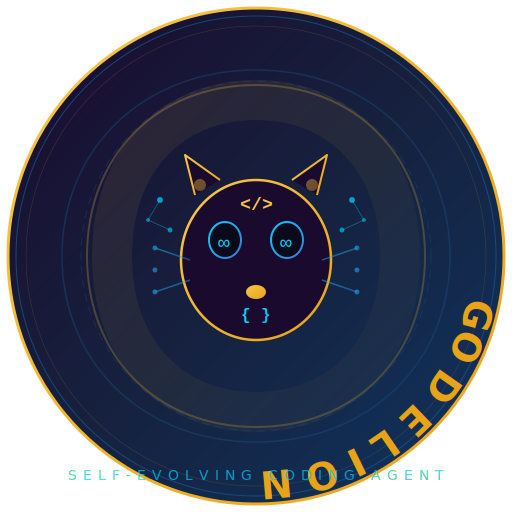
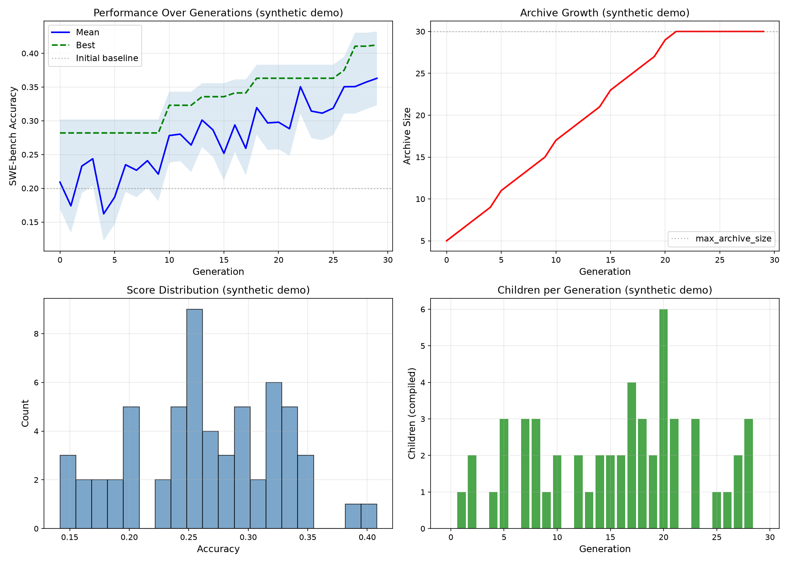

<div align="center">
  
</div>

<h1 align="center">
  🦁 Godelion
</h1>

<p align="center">
  <strong>Open-Ended Evolution of Self-Improving Coding Agents</strong><br>
  <em>Recursive Self-Improvement — Empirically Validated — Safely Sandboxed</em>
</p>

<p align="center">
  <a href="./LICENSE"></a>
  <a href="https://arxiv.org/abs/2505.22954"></a>
  
  
  
</p>

---

> **⚠️ WARNING: Self-Improving Systems Can Be Dangerous**
>
> Godelion is a research prototype that **rewrites its own source code** and validates those changes on
> live benchmarks. This is a form of **Recursive Self-Improvement (RSI)** — the system gets better at
> improving itself with every generation. While currently constrained to coding benchmarks, a sufficiently
> capable self-improving agent could theoretically produce modifications outside its intended scope.
>
> **You MUST run this only in isolated environments** such as:
> - **RunPod** or similar GPU cloud with strict network policies
> - **Docker containers** with network disabled and no internet access
> - **Air-gapped machines** disconnected from production systems
> - **Ephemeral VMs** destroyed after each experiment
>
> Never run this on production systems, machines with sensitive data, or environments that could affect
> the real world if the agent escapes its sandbox. Always review model-generated patches before
> applying them outside the Docker sandbox. The authors and contributors accept **zero liability**
> for misuse or unintended consequences.

---

## 🧬 What is Godelion?

Godelion is an **evolutionary self-improving coding system** — it writes code, evaluates how well that code
solves programming tasks (SWE-bench, Polyglot), then **rewrites its own source code** to fix the tasks it
failed. Each generation produces children that are empirically validated; the fittest survive. Over many
generations, the coding agent evolves to become more capable — not through human engineering but through
**Darwinian evolution applied to software itself**.

Think of it as an **RSI (Recursive Self-Improvement) seed**: a minimal starting program that can grow
its own capabilities by rewriting itself, validating each change against ground-truth benchmarks, and
compounding improvements over generations.

### Key Features

| Feature | Description |
|---------|-------------|
| **🧬 Darwinian Evolution** | Parents are selected by fitness; children inherit the best traits |
| **🔄 Recursive Self-Improvement** | The system rewrites its own `coding_agent.py`, tools, and prompts |
| **✅ Empirical Validation** | Every change is tested against real SWE-bench/Polyglot tasks |
| **🛡️ Docker Sandboxing** | All execution happens in isolated containers with optional network disable |
| **📊 Diversity Preservation** | An archive of past agents prevents premature convergence |
| **🔌 Multi-Model Support** | Anthropic, OpenAI, DeepSeek, Ollama, vLLM, LM Studio, OpenRouter |
| **💻 Local-First** | Run with free local models via Ollama/vLLM — no API keys required |
| **📈 Analysis Tooling** | Lineage tracking, performance plots, evolution visualization |
| **🔐 Safety-First** | Constitutional checks, human approval gates, protected files |
| **📦 Modern Python** | `pyproject.toml`, type hints, pre-commit hooks, CI config |

### What's New in v0.3.0+

| Feature | Description |
|---------|-------------|
| **🔬 Behavioral Diversity Metric** | Patch-content diversity measures *which source files* each agent modifies — catches behavioral convergence that lineage-only metrics miss |
| **🧬 Combined Diversity Scores** | Blends lineage (60%) and patch-content (40%) diversity for richer parent selection and archive management |
| **♻️ Improvement History Feedback** | Diagnosis prompts now include past improvement scores from the lineage, creating a compounding feedback loop |
| **📐 Archive Pruning** | `max_archive_size` config caps archive growth with diversity-aware eviction (score-primary, diversity-secondary) |
| **📏 Trivial Patch Filter** | `min_patch_lines` config filters out self-modifications too small to be meaningful (default: 3 lines) |
| **🔍 Patch-Aware Meta-Cognition** | The meta-cognitive validator now sees the actual patch diff and checks whether it addresses the diagnosed problem |
| **🛡️ Safer Meta-Cognitive Defaults** | When meta-cognitive analysis fails, the proposal is now *rejected* (was previously approved) — conservative by default |

### What's New in v0.2.0+

| Feature | Description |
|---------|-------------|
| **🧠 Meta-Cognitive Validation** | LLM-based risk/failure-mode/impact analysis rejects harmful proposals *before* expensive eval |
| **🌿 Diversity-Weighted Selection** | New parent selection blends accuracy (70%) + lineage diversity (30%) to prevent archive collapse |
| **💾 Per-Generation Checkpointing** | Automatic checkpoints enable resume from any generation |
| **📊 Patch Quality Analysis** | Tracks lines added/removed, files changed per patch for richer fitness data |
| **♻️ Auto-Resume** | `--resume` flag scans for latest checkpoint and continues from there |
| **🔧 Config-Driven** | All new options available via `config.yaml` — no CLI flags required |

---

## 📋 Table of Contents

- [Quick Start](#-quick-start)
- [How It Works](#-how-it-works)
- [Configuration](#-configuration)
- [Running with Local Models](#-running-with-local-models)
- [Running Experiments](#-running-experiments)
- [Analysis & Visualization](#-analysis--visualization)
- [Project Structure](#-project-structure)
- [Safety & Ethics](#-safety--ethics)
- [Extending Godelion](#-extending-godelion)
- [Troubleshooting](#-troubleshooting)
- [Contributing](#-contributing)
- [Changelog](./CHANGELOG.md)

---

## 🚀 Quick Start

### Prerequisites

- Python 3.10+
- Docker (with `docker run hello-world` working)
- At least one LLM API key (or a local Ollama/vLLM instance)

### 1. Install

```bash
git clone https://github.com/NullLabTests/godelion.git
cd godelion

python3 -m venv venv
source venv/bin/activate

pip install -e .

# Optional: for analysis & plotting
sudo apt-get install graphviz graphviz-dev
pip install -e ".[dev,analysis]"
```

### 2. Configure

```bash
cp config.yaml config.local.yaml
# Edit config.local.yaml with your model choice and API keys
```

Set your API keys (or skip if using local models):

```bash
export ANTHROPIC_API_KEY='sk-ant-...'
export OPENAI_API_KEY='sk-...'
# or
export DEEPSEEK_API_KEY='sk-...'
```

### 3. Prepare Benchmarks

```bash
# SWE-bench
cd swe_bench
git clone https://github.com/princeton-nlp/SWE-bench.git
cd SWE-bench
git checkout dc4c087c2b9e4cefebf2e3d201d27e36
pip install -e .
cd ../../

# Polyglot (optional)
git config --global user.email "you@example.com"
git config --global user.name "Your Name"
python -m polyglot.prepare_polyglot_dataset
```

### 4. Run Godelion

```bash
python run.py
```

That's it. The system will start evolving. Output is saved to `./output_godelion/`.

---

## 🧠 How It Works

### The Evolutionary Loop

```
┌─────────────────────────────────────────────────────────┐
│                     GENERATION N                          │
│                                                          │
│   ┌──────────┐    ┌──────────────┐    ┌──────────────┐  │
│   │  ARCHIVE  │───▶│   SELECT     │───▶│ SELF-IMPROVE │  │
│   │ (parents) │    │   PARENTS    │    │ (agent mutates│  │
│   │           │    │ (fitness +   │    │  its own code)│  │
│   │           │    │  diversity)  │    │              │  │
│   └──────────┘    └──────────────┘    └──────┬───────┘  │
│                                              │          │
│   ┌──────────┐    ┌──────────────┐    ┌──────▼───────┐  │
│   │  UPDATE  │◀───│   FILTER     │◀───│    EVAL      │  │
│   │ ARCHIVE  │    │ (compile OK) │    │ (SWE-bench   │  │
│   │          │    │              │    │  Polyglot)   │  │
│   └──────────┘    └──────────────┘    └──────────────┘  │
│                                                          │
└─────────────────────────────────────────────────────────┘
                          │
                          ▼
                     GENERATION N+1
```

### The Self-Improvement Process

1. **Diagnose**: The system reviews logs of failed coding tasks, identifies root causes
2. **Propose**: An LLM proposes a modification to `coding_agent.py`, tools, or prompts
3. **Implement**: The proposed change is implemented inside a Docker container
4. **Validate**: The modified agent is tested on held-out benchmark tasks
5. **Compete**: If the change improves performance (or at least doesn't regress), it enters the archive
6. **Repeat**: Future generations can build on any archived agent

### Architecture Overview

Godelion is structured as a **layered evolutionary system** with four main components:

| Layer | Component | Responsibility |
|-------|-----------|----------------|
| **Outer Loop** | `run.py` | Orchestrates generations: select parents, spawn self-improvement workers, filter results, update archive |
| **Self-Improvement** | `self_improve_step.py` | Single iteration: diagnose failures, spawn Docker sandbox, run coding agent, validate output |
| **Coding Agent** | `coding_agent.py` | The evolving agent: reads a problem statement, uses tools (bash, editor) to modify code |
| **Tool Layer** | `tools/` | Primitive capabilities (bash, file editing) exposed to the agent with structured schemas |

**Data flow per generation:**
```
Archive ─→ Parent Selection ─→ Self-Improve ─→ Eval ─→ Filter ─→ Archive
          (fitness +        (Docker sandbox,   (SWE-bench   (is_compiled,
          diversity)         meta-cognitive     Polyglot)    score >= thr)
                             validation?)
```

The **meta-cognitive validation** step runs *before* the expensive eval harness — it uses an LLM to assess risk, failure modes, and impact of the proposed change. Proposals with high regression risk or safety concerns can be rejected early, saving significant time and cost.

### RSI Seed Growth

This project is a **minimal seed for Recursive Self-Improvement**. The initial agent is capable enough to:

- Understand its own source code structure
- Diagnose its failures on coding benchmarks
- Propose and implement changes to itself
- Evaluate whether those changes actually help

As generations progress, the system becomes better at all of these tasks. The **meta-cognitive** ability to
improve its own improvement process is the key — this is what makes it an RSI seed rather than just another
code generator.

---

## ⚙️ Configuration

Godelion uses a **hierarchical YAML configuration system**:

1. `config.yaml` — Default configuration (committed to repo)
2. `config.local.yaml` — Local overrides (gitignored, never committed)
3. Environment variables — `GODELION_*` vars override YAML settings (e.g., `GODELION_EVOLUTION__MAX_GENERATIONS=100`)

### Key Configuration Sections

| Section | Key Settings |
|---------|-------------|
| `llm` | Model names, API keys, fallbacks, retry policy |
| `local` | Local model provider, URL, model names |
| `evolution` | Generations, selection method, archive policy |
| `evaluation` | Number of evals, shallow mode, thresholds |
| `docker` | Image name, timeouts, resource limits, network |
| `safety` | Constitutional checks, protected files, approvals |
| `logging` | Log level, output directory, retention |
| `checkpoint` | Checkpoint interval, compression |
| `benchmark` | Dataset paths, subset sizes |
| `tools` | Custom tool directories, disabled tools |

See [config.yaml](./config.yaml) for the complete reference.

---

## 🤖 Running with Local Models

Godelion fully supports **free, local, offline models**.

### Option 1: Ollama

```yaml
# config.local.yaml
local:
  enabled: true
  provider: "ollama"
  base_url: "http://localhost:11434/v1"
  coding_model: "deepseek-coder-v2"
  diagnose_model: "qwen2.5-coder:32b"
```

```bash
ollama pull deepseek-coder-v2
ollama pull qwen2.5-coder:32b
python run.py
```

### Option 2: vLLM

```yaml
local:
  enabled: true
  provider: "vllm"
  base_url: "http://localhost:8000/v1"
  coding_model: "deepseek-ai/DeepSeek-Coder-V2-Instruct"
  diagnose_model: "deepseek-ai/DeepSeek-R1-Distill-Qwen-32B"
```

### Option 3: LM Studio

```yaml
local:
  enabled: true
  provider: "lm_studio"
  base_url: "http://localhost:1234/v1"
  coding_model: "local-model"
  diagnose_model: "local-model"
```

### Cost Comparison

| Provider | Coding Model (per 1M tokens) | Diagnose Model | Cost per 80-gen run |
|----------|------------------------------|----------------|---------------------|
| Claude Sonnet 4 | $3.00 / $15.00 | Same | ~$2,000-5,000 |
| GPT-4o | $2.50 / $10.00 | Same | ~$1,500-4,000 |
| DeepSeek API | $0.27 / $1.10 | Same | ~$200-500 |
| **Local Ollama** | **$0.00 / $0.00** | **Same** | **$0 (GPU cost only)** |

---

## 🧪 Running Experiments

### Basic Run

```bash
python run.py
```

### Custom Run

```bash
# 40 generations, 4 children per generation, 4 parallel workers
python run.py --config config.local.yaml --max-generation 40 --selfimprove-size 4 --selfimprove-workers 4
```

### Selection Methods

```bash
# Diversity-weighted selection (accuracy + lineage + patch-content diversity)
python run.py --selection-method diversity_weighted

# Pure accuracy-based selection
python run.py --selection-method best

# Accuracy-proportional with child count anti-preference + gentle diversity boost (default)
python run.py --selection-method score_child_prop
```

> **Note**: The default `score_child_prop` method now includes a subtle diversity multiplier (0.9–1.1×) that gently prefers agents with distinct behavioral profiles without overriding the accuracy signal.

### Archive Management

```bash
# Keep all children (maximum diversity, default)
python run.py --update-archive keep_all

# Keep only children that exceed baseline accuracy
python run.py --update-archive keep_better

# Keep children with diversity bonus for novel lineages
python run.py --update-archive keep_diverse

# Cap archive at 30 members with diversity-aware pruning (evicts lowest-score, lowest-diversity)
python run.py --max-archive-size 30

# Disable pruning entirely (unlimited growth)
python run.py --max-archive-size 0
```

### Meta-Cognitive Validation

```bash
# Enable meta-cognitive proposal validation (default: on)
python run.py

# Disable meta-cognitive validation (faster, less safe)
python run.py --no-meta-cognitive
```

### Auto-Resume from Checkpoint

```bash
# Resume from the latest checkpoint in the output directory
python run.py --resume
```

### Baseline Comparisons

```bash
# No self-improvement (just the initial agent)
python run.py --run-baseline no_selfimprove

# No Darwin selection (always use the latest commit)
python run.py --run-baseline no_darwin
```

### Continuing a Previous Run

```bash
python run.py --continue-from ./output_godelion/20250101_120000_123456
```

### Polyglot Benchmark

```bash
python run.py --polyglot
```

---

## 📊 Analysis & Visualization

```bash
# Performance over generations
python -m analysis.plot_performance --output-dir ./output_godelion/20250101_120000_123456

# Synthetic demo (no run required — tests your visualization setup)
python -m analysis.plot_performance --output-dir . --demo

# Lineage tree (requires graphviz)
python -m analysis.plot_lineage --output-dir ./output_godelion/20250101_120000_123456

# Full HTML report
python -m analysis.report --output-dir ./output_godelion/20250101_120000_123456
```


*Synthetic demo showing the type of output generated after a multi-generation run. Real runs produce the same 4-panel figure from actual evolutionary data.*

---

## 📁 Project Structure

```
godelion/
├── run.py                    # Main evolutionary entry point
├── self_improve_step.py      # Single self-improvement iteration
├── config.yaml               # Default configuration
├── config.local.yaml         # Local overrides (gitignored)
├── godelion/
│   ├── __init__.py           # Package init, version
│   ├── config.py             # Configuration loader
│   ├── llm.py                # LLM client factory (multi-provider)
│   ├── llm_withtools.py      # LLM + tool calling orchestration
│   ├── coding_agent.py       # The coding agent (evolves!)
│   └── coding_agent_polyglot.py  # Polyglot-specific agent variant
├── tools/
│   ├── bash.py               # Bash shell tool
│   └── edit.py               # File editing tool
├── prompts/
│   ├── self_improvement_prompt.py  # Evolution diagnosis prompts
│   ├── diagnose_improvement_prompt.py  # Improvement evaluation
│   ├── testrepo_prompt.py    # Test execution instructions
│   └── tooluse_prompt.py     # Tool usage patterns
├── utils/
│   ├── common_utils.py       # JSON/file I/O
│   ├── docker_utils.py       # Container management
│   ├── eval_utils.py         # Test scoring
│   ├── evo_utils.py          # Evolution utilities
│   ├── git_utils.py          # Git/patch operations
│   └── swe_log_parsers.py    # Test log parsers
├── swe_bench/                # SWE-bench integration
├── polyglot/                 # Polyglot benchmark integration
├── analysis/                 # Analysis & visualization
├── tests/                    # Test suite (36 tests, 31 pass)
├── misc/                     # Logo, diagrams, banners
├── Dockerfile                # Container definition
└── pyproject.toml            # Python packaging
```

---

## 🛡️ Safety & Ethics

### Why This Matters

Self-improving systems are the **most important and most dangerous** technology on the horizon. A system
that can rewrite itself without human supervision could, in principle, undergo rapid capability gains —
and if misaligned, cause catastrophic harm. This project is a research tool for studying such systems
**safely and responsibly**.

### Built-in Safeguards

1. **🧪 Docker Sandboxing**: All code execution happens in ephemeral containers
2. **🔒 Network Isolation**: Containers can run with `--network none`
3. **👁️ Human Review**: All proposed patches are logged for inspection
4. **📝 Constitutional Checks**: Optional pre-approval of self-modifications
5. **🛡️ Protected Files**: Critical config files cannot be modified by the agent
6. **📊 Empirical Validation**: No change is accepted without measurable improvement
7. **⏱️ Timeouts**: Hard limits prevent runaway self-improvement
8. **📈 Full Audit Trail**: Every generation, every patch, every evaluation is logged

### Risks You Accept

- The system **will modify its own source code** — these changes are automatically generated
- Patches may contain subtle bugs even if they pass the benchmarks
- The system could potentially escape its Docker sandbox (extremely unlikely but not impossible)
- Future, more capable models could accelerate improvement beyond safe rates

### Ethical Usage Guidelines

- **Always run in isolated environments** (RunPod, dedicated cloud VMs, air-gapped)
- **Review generated patches** before using them outside the experiment
- **Set conservative limits** on generations and parallel workers
- **Monitor the system** during operation — watch for unexpected behavior
- **Do not deploy** self-improved agents to production without thorough testing
- **Do not connect** the system to the internet inside the container (set `network_disabled: true`)
- **Share results responsibly** — this is research, not a product

---

## 🔌 Extending Godelion

### Adding a New Tool

```python
# tools/my_tool.py
def tool_info():
    return {
        "name": "my_tool",
        "description": "Does something useful",
        "input_schema": {
            "type": "object",
            "properties": {
                "param": {"type": "string", "description": "A parameter"}
            },
            "required": ["param"]
        }
    }

def tool_function(param: str) -> str:
    return f"Result: {param}"
```

Auto-discovered and available to the agent immediately.

### Adding a New Benchmark

Create a new directory following the `swe_bench/` or `polyglot/` pattern, then add it to
`config.yaml` under `benchmark`.

---

## 🔧 Troubleshooting

### "Docker is not running"
```bash
sudo systemctl start docker
sudo usermod -aG docker $USER
newgrp docker
```

### "Model response is too long"
Increase context window or reduce prompt size. Check `config.yaml` → `llm.api.max_tokens`.

### "Self-improvement times out"
Increase `docker.timeout_seconds` or reduce `evolution.selfimprove_size`.

### "Container runs out of memory"
Set `docker.memory_limit` in config, e.g., `"8g"`.

### "Cannot connect to local model"
Verify the model is running: `curl http://localhost:11434/v1/models` (Ollama) or
`curl http://localhost:8000/v1/models` (vLLM).

---

## 🤝 Contributing

Contributions are welcome! See [CONTRIBUTING.md](./CONTRIBUTING.md) for guidelines.

```bash
pip install -e ".[dev]"
pre-commit install
pytest
```

---

## 📜 Changelog

See [CHANGELOG.md](./CHANGELOG.md) for the full history of changes.

---

## 📖 Attribution

This project builds on prior research into self-improving systems. See [NOTICE](./NOTICE)
for legal attributions. If you use this work in your research, please cite:

```bibtex
@software{godelion2025,
  title = {Godelion: Open-Ended Evolution of Self-Improving Coding Agents},
  author = {Godelion Contributors},
  year = {2025},
  url = {https://github.com/NullLabTests/godelion}
}
```

---

<p align="center">
  
  <br>
  <strong>Built with 🔬 for open research into safe, self-improving systems.</strong>
</p>
